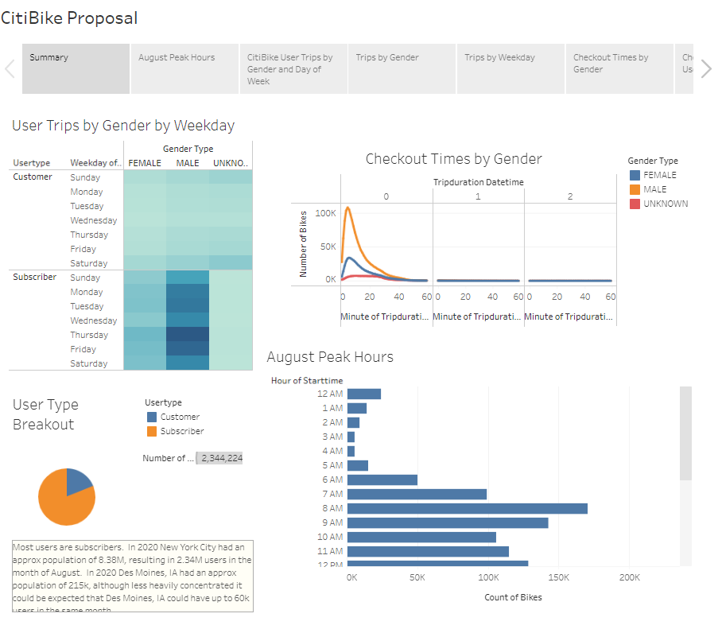

# BikeSharing
Within Tableau, used provided data to create a story and multiple dashboards to analyze and visualize CitiBikes data.  This required the use of Python and Jupyter notebook.

## Overview
The following are the challenge deliverables:
- Deliverable 1: Change Trip Duration to a Datetime Format
- Deliverable 2: Create Visualizations for the Trip Analysis
- Deliverable 3: Create a Story and Report for the Final Presentation

## Resources
- Dataset: downloaded 201908-citibike-tripdata.csv.zip file from the CitiBike Link [CitiBike Public Link](https://s3.amazonaws.com/tripdata/index.html)
- Software:
  - Python
  - Pandas / Jupyter Notebook
  - Tableau Public

## Results
The presentation used data based on New York City in order to present a plan to expand to Des Moines, Iowa.  Based on the Tableau dashboard it can be determined whether to expand to Des Moines, and how much bike utilization is expected.  Before creating the Tableau dashboard I was required to convert data in [jupyter notebook](https://github.com/Jahill17/bikesharing/blob/main/NYC_CitiBike_Challenge.ipynb).

My findings show that most users are subscribers and of those users most are males who use the bikes between the hours of 4-5pm on Thursdays and Fridays.  In 2020 New York City had an approx population of 8.38M, resulting in 2.34M users in the month of August.  In 2020 Des Moines, IA had an approx population of 215k, although less heavily concentrated it could be expected that Des Moines, IA could have up to 60k users in the same month.

[Link to Tableau Dashboard](https://public.tableau.com/app/profile/jonathan.hill8424/viz/CitBikeBikesharingPorposal/CitiBikeProposal)

